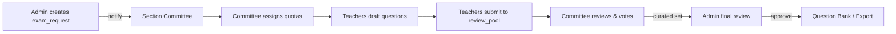
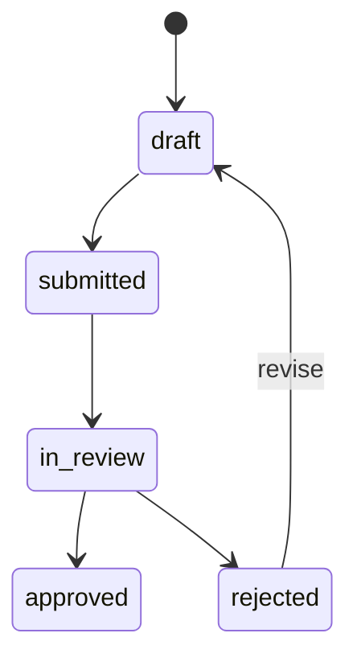

# Part 2 — Delegation & Review Pool (Design)

Note: DESIGN ONLY. This document describes Firestore layout, data flows, status transitions, integration points, and edge-case handling for Part 2: Teacher Drafting & Collaborative Curation.

## 1. Firestore Collections Structure

Guiding principle: most data is scoped to an `exam_request` so Team/Committee-specific state is isolated and queries are simple and cheap.

- `exam_requests/{examId}/teacher_quotas` (subcollection)
  - Purpose: store quota assignments for the specific exam request.
  - Suggested fields:
    - `teacherId` (string)
    - `courseId` (string)
    - `topics` (array of topicIds) — optional, narrow assignment
    - `quotaCount` (int) — number of questions requested
    - `assignedBy` (userId of committee member)
    - `status` (string) — `pending|assigned|drafting|completed|reassigned`
    - `deadline` (timestamp) — teacher internal deadline
    - `createdAt`, `updatedAt` (timestamps)
    - `notes` (string) — optional
  - Rationale: subcollection keeps quotas tightly bound to the exam lifecycle and simplifies security rules.

- `exam_requests/{examId}/review_pool` (subcollection)
  - Purpose: holds question drafts submitted by Teachers and the canonical place for Committee curation.
  - Each doc = one question draft. Suggested fields:
    - `draftId` (auto id)
    - `teacherId` (string)
    - `questionText` (string)
    - `options` (array of objects {text, isCorrect})
    - `topics` (array)
    - `difficulty` (enum: Easy|Medium|Hard)
    - `status` (string) — `draft|submitted|in_review|approved|rejected`
    - `submittedAt`, `createdAt`, `updatedAt`
    - `versionOf` (optional reference) — points to original question id when this is an edited version
    - `flag` (string) — e.g., `error_do_not_use`
    - `voteCounts` (map) — pre-aggregated counts for quick ranking (e.g., `{keep: 3, drop: 2}`)
  - Notes: keep full question payload here; once approved a lightweight reference can be copied to the question bank.

- `exam_requests/{examId}/review_pool/{draftId}/review_votes` (subcollection)
  - Purpose: individual vote records per committee member per draft.
  - Fields:
    - `voterId` (string)
    - `vote` (string) — `keep|drop|abstain` (or numeric score if using scoring)
    - `createdAt` (timestamp)
    - `isTieBreaker` (boolean) — set if the voter is the Committee Lead and this vote resolved a tie
  - Rationale: subcollection per draft keeps write contention small and allows replay/audit of votes.

Additional (global) collections:
- `question_bank/{questionId}` — immutable approved questions (write-once semantics; if edited, create new doc and flag old as `error_do_not_use`).
- `users/{userId}` — user role claims (teacher, committee, lead, admin) used by security rules.

## 2. Data Flow (simple diagram)

Notes: notifications delivered via FCM topics (from Part 1 infrastructure). Real-time listeners on `teacher_quotas` and `review_pool` keep UIs in sync.

## 3. Status Transitions

- Question lifecycle (document `exam_requests/{examId}/review_pool/{draftId}`):
  - `draft` → `submitted` → `in_review` → `approved` | `rejected`
    - `draft`: created by Teacher, local edits allowed.
    - `submitted`: Teacher hits Submit; becomes visible in Committee's review pool.
    - `in_review`: Committee has opened/voting window; vote records are collected.
    - `approved`: moved to question bank (copy and mark locked); original draft status set to `approved`.
    - `rejected`: optionally send back with notes for revision.

- Quota lifecycle (document `exam_requests/{examId}/teacher_quotas/{quotaId}`):
  - `pending` → `assigned` → `drafting` → `completed`
    - `pending`: created by Committee but not yet assigned to a specific teacher.
    - `assigned`: teacher receives assignment and internal deadline.
    - `drafting`: teacher has begun drafting (first draft saved or status flip).
    - `completed`: teacher submitted at least their `quotaCount` accepted drafts or deadline passed and quota re-assigned.

Small mermaid state example for question lifecycle:

## 4. Integration Points with Part 1 & Part 3

- Needs from Part 1 (backend branch):
  - Authentication & role-based claims (`users/{userId}` with roles).
  - `exam_requests` base collection and creation workflows by `Admin`.
  - Taxonomy collections (`departments`, `courses`, `topics`) for tagging drafts.
  - Firestore security rules templates for subcollection scoping (enforce only assigned teachers can submit to their quotas; only committee members can vote).
  - Notification infra (FCM topics and helper cloud functions) to alert Teachers and Committee members.

- What Part 2 will provide to Part 3 (export branch):
  - A finalized, locked `exam_requests/{examId}/finalized` or an `exams/{examId}` artifact containing approved questions and metadata (semester, year, logo reference).
  - Approved question copies or references in `question_bank/` (immutable) that the export function can read.
  - Metadata for randomization: approved question IDs, canonical options arrays, and any shuffle constraints.

## 5. Edge Cases & Handling

- Teacher exceeds quota:
  - Detection: Track `submittedCount` per `teacher_quotas` and enforce UI restriction on submit.
  - Resolution: accept additional submissions but mark extras as `overflow` or prevent submission and require Committee re-allocation. Prefer: allow but flag extras; Committee decides which to keep.

- Missed deadlines:
  - Detection: Cloud function or client-side scheduled check compares `teacher_quotas.deadline` to `now()`.
  - Resolution options:
    - Auto-notify Committee with a `non_compliance` alert and mark quota `reassignable`.
    - Committee may reassign remaining quota to other teachers or request an extension from Admin.

- Tie votes:
  - Mechanism: votes are tallied from `review_votes`. If top/threshold selection results in tie:
    - First: check for Committee Lead vote with `isTieBreaker=true` and apply it.
    - Second: if no lead or still tied, escalate to Committee discussion (UI prompt) or fall back to deterministic tiebreaker (e.g., earliest submitted wins) — prefer human escalation.

## Notes & Recommendations

- Security rules should scope writes to subcollections under `exam_requests/{examId}` and use role-claims from `users/{userId}`.
- Aggregate vote counts should be maintained in the draft doc (`voteCounts`) via transaction or a Cloud Function trigger to avoid expensive fan-in on read.
- Keep most UI queries limited to the current `exam_request` to minimize reads and improve cost predictability.

---
Generated for Part 2 design work; no implementation steps included in this file.
